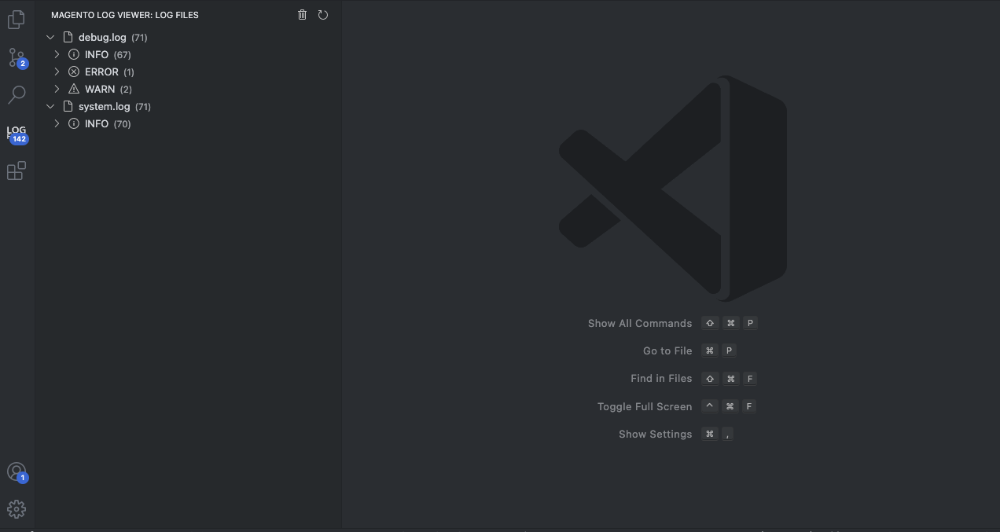

# Magento Log Viewer

The Magento Log Viewer extension for Visual Studio Code allows you to easily view and manage log files in your Magento project. This extension provides a tree view of log files, the ability to open and clear log files, and a status bar item showing the number of log entries.

## Features

- **View Log Files**: Displays a tree view of log files in the `var/log` directory of your Magento project.
- **Open Log Files**: Open log files directly in the editor by clicking on them in the tree view.
- **Collapsible Log Lines**: Each log file can be expanded to view individual lines.
- **Clear Log Files**: Clear all log files with a single command.
- **Status Bar Item**: Shows the number of log entries in the status bar.

## Requirements

- Visual Studio Code version 1.95.0 or higher.
- A Magento project with log files located in the `var/log` directory.

## Getting Started

1. **Install the extension**: Install the Magento Log Viewer extension from the Visual Studio Code marketplace.
2. **Open your Magento project**: Open your Magento project in Visual Studio Code.
3. **Configure the extension**: When you open a workspace, the extension will prompt you to specify if it is a Magento project. If you select "Yes", you will be prompted to select the Magento root folder.
4. **View log files**: The log files will be displayed in the tree view under the "Magento Log Viewer" activity bar.
5. **Open log files**: Click on any log file in the tree view to open it in the editor.
6. **Expand log files**: Click on the arrow next to a log file to expand and view individual lines.
7. **Clear log files**: Use the "Clear all Logs" command to delete all log files in the `var/log` directory.

## Usage

1. **Install the extension**: Install the Magento Log Viewer extension from the Visual Studio Code marketplace.
2. **Configure the extension**: When you open a workspace, the extension will prompt you to specify if it is a Magento project. If you select "Yes", you will be prompted to select the Magento root folder.
3. **View log files**: The log files will be displayed in the tree view under the "Magento Log Viewer" activity bar.
4. **Open log files**: Click on any log file in the tree view to open it in the editor.
5. **Expand log files**: Click on the arrow next to a log file to expand and view individual lines.
6. **Clear log files**: Use the "Clear all Logs" command to delete all log files in the `var/log` directory.

**Enjoy!**
