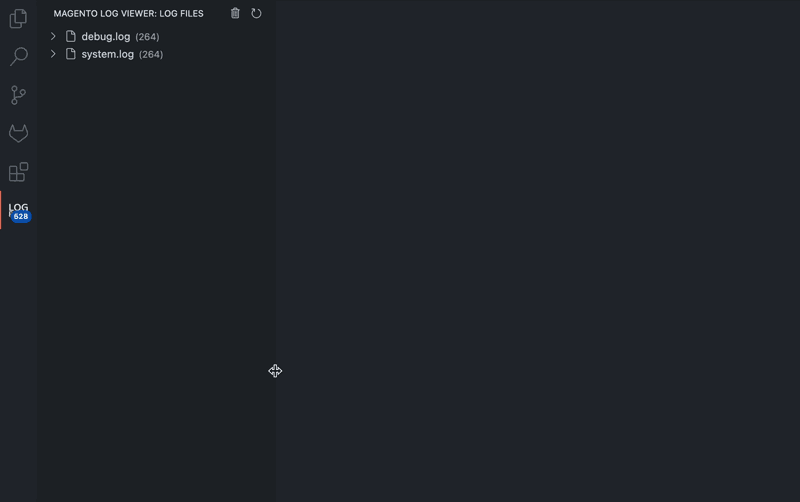

# Magento Log Viewer
 

The Magento Log Viewer extension for Visual Studio Code provides a convenient way to view and manage Magento log files directly in your workspace.

## Features

- Tree view of log files from Magento's `var/log` directory
- Section for Grouped log entries by severity level (ERROR, WARN, DEBUG, INFO)
- Section for Report files with parsed and optimized titles
- **Quick Search/Filter Box** - Real-time filtering of log entries with case-sensitive and regex support
- **Advanced Search Options** - Search through log entries with pattern matching and text filtering
- **Intelligent File Caching** - Enhanced performance with smart memory management and ~80% faster file reads
- Option to group log entries by message content
- Direct file opening with line highlighting
- One-click log file clearing with confirmation popup
- Status bar showing total log entries with active search indicator
- Real-time log file monitoring with optimized cache invalidation
- Badge in the tree view showing the total number of log entries
- Improved report file titles by parsing content for better readability
- Color-coded icons for different log levels (ERROR, WARN, DEBUG, INFO)
- Individual report file deletion through context menu
- Automatic update notifications for new extension versions
- Line-by-line navigation within log files
- Collapsible sections for identical report error titles
- Project setting retention between workspace sessions

## Setup

1. Install the extension from VS Code marketplace
2. Open your Magento project workspace
3. When prompted, confirm it's a Magento project
4. Select your Magento root directory
5. The extension will now load your log files

Note: Settings are workspace-specific, allowing different configurations for each Magento project. The extension features intelligent file caching for improved performance, especially with large log files.

## Usage

- **View Logs**: Open the Magento Log Viewer sidebar (M logo)
- **Search Logs**: Click the search icon in the log view header to filter entries in real-time
  - **Text Search**: Enter any text to filter log entries containing that text
  - **Case-Sensitive**: Enable in settings (`magentoLogViewer.searchCaseSensitive`) for exact case matching
  - **Regex Support**: Enable in settings (`magentoLogViewer.searchUseRegex`) for pattern matching (e.g., `error.*critical`)
  - **Clear Search**: Click the clear icon (visible during active search) to remove filters
- **Clear Logs**: Click the trash icon in the view header. A confirmation popup will appear to confirm the action.
- **Refresh**: Click the refresh icon or wait for auto-update
- **Navigate**: Click on log entries to jump to specific lines
- **Filter**: Expand log files to see entries grouped by severity
- **Group by Message**: Enable or disable grouping of log entries by message content in the settings. When enabled, the counter will display "grouped" (e.g., `INFO (128, grouped)`).
- **Delete Reports**: Right-click on a report file entry and select "Delete Report File" from the context menu
- **View Updates**: Review update notifications when the extension is updated with links to changelog and GitHub

## Requirements

- VS Code 1.95.0+

**Enjoy!**
