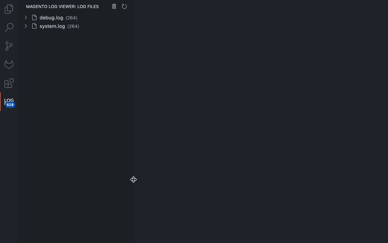

# 🚀 Magento Log Viewer for VS Code

[](https://app.codacy.com/gh/OpenForgeProject/vscode-ext-magento-log-viewer/dashboard?utm_source=gh&utm_medium=referral&utm_content=&utm_campaign=Badge_grade) [](https://github.com/OpenForgeProject/vscode-ext-magento-log-viewer/actions/workflows/test.yml) 

**Professional Log Viewer for Magento & Adobe Commerce Developers**

A powerful VS Code extension designed to enhance your Magento development workflow by providing real-time log monitoring, advanced search capabilities, and intelligent log management directly within your code editor.



## ✨ Key Features

### � **Real-Time Log Tailing** 🆕

- **Live Monitoring** - Watch log files update in real-time as new entries are written
- **Intelligent Updates** - Only new content is read (no full file re-reads)
- **One-Click Activation** - Right-click any log file → "Start Tailing"
- **Smart Notifications** - Automatic alerts for new ERRORs and CRITICAL entries (throttled to prevent spam)
- **Memory Safe** - Maximum 5 files simultaneously, large file warnings (>100MB)
- **Persistent State** - Optional: Remember tailed files across VS Code restarts
- **Configurable Speed** - Update intervals from instant (100ms) to relaxed (2s)

### �📁 **Smart Log Management**

- **Structured Tree View** - All log files from `var/log/` organized clearly
- **Color-coded Log Levels** - ERROR (red), WARN (orange), DEBUG (yellow), INFO (blue), CRITICAL (pink)
- **Report File Integration** - Automatic analysis and grouping of `var/report/` files
- **Real-time Monitoring** - Live updates when files change

### 🔍 **Advanced Search Capabilities**

- **Real-time Search** - Instant filtering as you type
- **Regex Support** - Powerful pattern matching (e.g., `error.*critical`)
- **Case-sensitive Options** - Precise search with case sensitivity control
- **Smart Grouping** - Identical log entries are automatically grouped

### ⚡ **Performance Optimization**

- **Intelligent Caching** - Up to 80% faster file access
- **Memory Management** - Automatic cache memory optimization
- **Configurable Limits** - Adjust cache size based on project needs
- **Performance Statistics** - Detailed cache metrics for developers

### 🛠️ **Automated Maintenance**

- **Auto-Cleanup** - Automatic deletion of old log files by configurable age
- **Periodic Cleanup** - Cron-like scheduling (5min to 24h intervals)
- **One-Click Cleanup** - Instant deletion with safety confirmation
- **Bulk Operations** - Delete report files individually or all at once

## 🚀 Quick Start

### Installation & Setup

1. **Install Extension** - Direct from VS Code Marketplace
2. **Open Magento Project** - Load workspace in VS Code
3. **Confirm Project** - Automatic detection with confirmation dialog
4. **Select Magento Root** - Integrated folder picker for easy configuration
5. **Done!** - Log files are automatically loaded

> **💡 Tip:** The extension saves all settings workspace-specific, allowing different configurations for different Magento projects.

### Getting Started

- **Open Log Viewer** - Click the Magento logo (M) in the sidebar
- **Search Logs** - Search icon in the header for live filtering
- **Open Files** - Direct click on log entries jumps to the corresponding line
- **Manage Reports** - Right-click menu for individual report deletion

## 📖 Detailed Usage

### 📡 Real-Time Log Tailing 🆕

Perfect for debugging live issues - see errors as they happen!

**How to Use:**

1. **Right-click** on any log file in the tree view
2. Select **"Start Tailing"** from context menu
3. **Watch live** - New log entries appear automatically
4. **Stop anytime** - Right-click → "Stop Tailing" or use "Stop All Tailing" in maintenance menu

**Features:**

- **📊 Live Updates** - New entries appear instantly (configurable interval: 100ms to 2s)
- **🚨 Smart Alerts** - Automatic notifications for ERROR/CRITICAL entries (max 1/minute)
- **💾 Memory Safe** - Position tracking ensures only new content is read
- **⚡ Performance** - Incremental parsing without full file reload
- **📌 Persistent** - Optional: Restore tailing after VS Code restart

**Configuration:**

```json
{
  "magentoLogViewer.tailingUpdateInterval": "500ms", // How fast to check for updates
  "magentoLogViewer.tailingAutoScroll": true, // Auto-scroll to new entries
  "magentoLogViewer.tailingPersistAcrossSessions": false // Remember after restart
}
```

**Best Practices:**

- Use **instant** (100ms) for critical debugging sessions
- Use **500ms** (default) for normal development
- Use **1s-2s** for low-priority monitoring
- Maximum **5 files** can be tailed simultaneously
- Files >100MB show warning before tailing starts

### Log Management

- **📊 Overview** - All log files with badge display of entry count
- **🔄 Auto-Refresh** - Automatic updates when files change
- **📋 Grouping** - Identical messages are summarized (`INFO (128, grouped)`)
- **🎯 Navigation** - Direct jump to specific lines in code

### Advanced Search

- **🔍 Text Search** - Simple text input filters all relevant entries
- **⚡ Real-time Filter** - Instant results while typing
- **🎯 Case-Sensitive** - Activatable via settings for exact case matching
- **🔧 Regex Patterns** - Advanced search patterns for complex filtering
  - Example: `error.*critical` finds all ERROR logs with "critical"
  - Example: `\[2024-12-\d+\]` for all December 2024 entries
- **🧹 Clear Search** - Clear button (visible during active search)

### Automatic Cleanup

- **⏰ Auto-Cleanup** - Configurable deletion by file age
  - Supported formats: `30min`, `2h`, `7d`, `2w`, `3M`
  - Disabled by default for safety
- **🔄 Periodic Cleanup** - Automatic execution at intervals
  - Intervals: 5min to 24h selectable
  - Recommended: `1h` for production, `6h` for development
- **🗑️ Manual Cleanup** - Clock icon for immediate cleanup
- **⚠️ Safety** - Confirmation dialogs for critical operations

### Report Management

- **📁 Structured View** - Automatic title optimization through content parsing
- **🔍 Separate Search** - Independent search function for report files
- **🗑️ Selective Deletion** - Individual reports via right-click context menu
- **🧹 Bulk Operations** - Delete all reports at once

## ⚙️ Configuration

### Performance Settings

```json
{
  "magentoLogViewer.cacheMaxFiles": 50, // Max files in cache
  "magentoLogViewer.cacheMaxFileSize": 10, // Max file size in MB
  "magentoLogViewer.enableCacheStatistics": false // Debug statistics
}
```

### Cleanup Configuration

```json
{
  "magentoLogViewer.enableAutoCleanup": false, // Enable auto-cleanup
  "magentoLogViewer.autoCleanupMaxAge": "7d", // Maximum file age
  "magentoLogViewer.enablePeriodicCleanup": false, // Periodic execution
  "magentoLogViewer.periodicCleanupInterval": "6h" // Cleanup interval
}
```

### Display Options

```json
{
  "magentoLogViewer.groupByMessage": true, // Group messages
  "magentoLogViewer.searchCaseSensitive": false, // Case-sensitive search
  "magentoLogViewer.searchUseRegex": false // Regex support
}
```

## 🎯 Supported Magento Versions

- ✅ **Magento 2.x** (all versions)
- ✅ **Adobe Commerce** (On-Premise & Cloud)
- ✅ **Adobe Commerce Cloud**
- ✅ **Magento Open Source**
- ✅ **Custom Log Structures**

## 🔧 System Requirements

- **VS Code** 1.95.0 or higher
- **Magento Project** with standard `var/log` and `var/report` structure
- **Node.js** (automatically installed with VS Code)

## 🤝 Support & Contributing

### Report Issues

- 🐛 **Bug Reports** - [GitHub Issues](https://github.com/OpenForgeProject/vscode-ext-magento-log-viewer/issues)
- 💡 **Feature Requests** - [GitHub Discussions](https://github.com/OpenForgeProject/vscode-ext-magento-log-viewer/discussions)

### Support Development

- ⭐ **Rate Extension** - [VS Code Marketplace](https://marketplace.visualstudio.com/items?itemName=MathiasElle.magento-log-viewer)
- 💖 **Sponsoring** - [GitHub Sponsors](https://github.com/sponsors/dermatz)
- 🔧 **Contributing** - Pull requests welcome!

## 📄 License

This project is licensed under the **GNU General Public License v3.0**.
See the [LICENSE](LICENSE) file for details.

---

**Built with ❤️ for the Magento Community**

_Enhance your productivity with intelligent log management directly in VS Code!_
